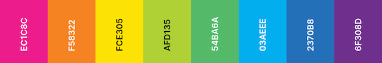

# Lisa Frank Inspired VSCode Theme 🎨🌈


<div align="center">

 

Lisa Frank inspired color theme for VS Code. *In-progress...*

</div>

---

### Colors




<!-- ### Install

press `ctrl/command + p` to launch quick open then run
```
ext install
``` -->


### Contributing
[@kwing25](https://github.com/kwing25)


[](https://forthebadge.com)
